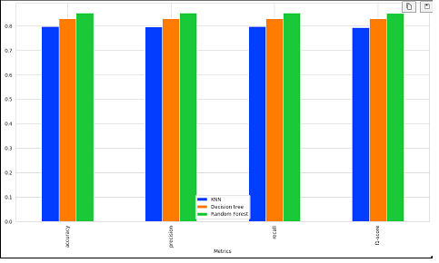

##Natural language processing (NLP)# Driver's License Type Prediction

## Introduction

We are training a Machine Learning model to classify and predict the driving license type held by different drivers in Dubai. By using Machine Learning's classification type algorithm we will be predicting License Type that driver hold.

## Dataset

We have Data from Driver's population census in Dubai. We have tabular data with overall 5 columns in which 1 column contain content in Arabic linguistics and rest of the columns are numeric and object types.
### Dataset Statistics:

Here is sample statistics of the data.

- **Name:** Drivers_Population_Census
- **Mode:** Tabular Data
- **Number of Samples:** 
  - Train: 2,247 
  - Test: 561
- **Type:** Classification
- **Number of Classes:** 4
- **Classes Name:** 
  - Registration
  - Transfer of Ownership
  - Change number plate
  - Update Info

## Pre-processing

The preprocessing steps of the proposed project are the following:
<list of preprocessing steps>

1. Made new list and replaced Arabic Linguistics content into English linguistics
2. Apply One-hot encoding on Gender and age_group columns
3. Apply Label encoding on Nationality and License_type columns
4. To avoid over sampling we use sampling_strategy method from SMOTE module to avoid class imbalancing

## Models

For the Traffic License Prediction in Dubai following models were trained with the tuned hyperparameters:

- **K-Nearest Neibhour**
  - n_neighbors=3

- **Decision Tree**
  - GridSearchCV with parameter 
      - criterion : ['gini', 'entropy'],
      - splitter : ['best', 'random'],
      - max_depth : [None, 10, 20, 30, 40, 50],
      - min_samples_split : [2, 5, 10],
      - min_samples_leaf : [1, 2, 4],
      - max_features : ['auto', 'sqrt', 'log2', None]
  - cross validation = 5
  - scoring = f1
  - estimator=dt_model

  **Random Forest**
  - GridSearchCV with parameter 
      - criterion : ['gini', 'entropy'],
      - min_sample_leaf = [1, 2, 4]
      - max_depth : [None, 10, 30],
  - cross validation = 5
  - scoring = accuracy
  - estimator=rf_model

## Results

| Metrics    |    KNN   | Decision Tree | Random Forest |
|------------|----------|---------------|---------------|
| Accuracy   | 0.796889 |     0.829826  |     0.852242   |
| Precision  | 0.796594 |     0.830111  |     0.852526   |
| Recall     | 0.796921 |     0.829830  |     0.852233   |
| F1-Score   | 0.792896 |     0.829060  |     0.851289   |

 

## Dependencies

- **numpy**: For numerical operations.
- **pandas**: For data manipulation and analysis.
- **scikit-learn**: For machine learning tools.
- **matplotlib**: For data visualization.
- **seaborn**: For data visualization.
- **tabulate**: For creating formatted tables in plain-text format.

